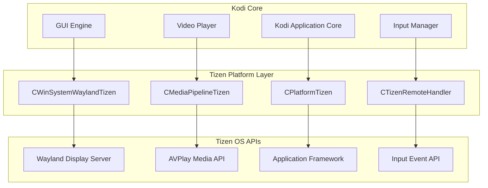
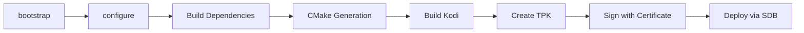

# Design Document: Kodi Tizen Migration

## Overview

This design document outlines the technical approach for porting Kodi media center to Samsung's Tizen smart TV platform. The migration follows the established pattern used for the webOS port, adapting it to Tizen's specific APIs and requirements.

The implementation consists of five major components:

1. **Build System Integration** - CMake configuration for Tizen toolchain and dependencies
2. **Platform Abstraction Layer** - Tizen-specific implementation of Kodi's platform interface
3. **Windowing System** - Wayland-based window management for Tizen
4. **Media Pipeline** - Integration with Tizen's AVPlay multimedia APIs
5. **Input Handling** - TV remote control event processing

The design leverages Tizen's native C++ APIs while maintaining compatibility with Kodi's cross-platform architecture. The webOS implementation serves as a reference, as both platforms use Wayland for windowing and require similar TV-specific adaptations.

## Architecture

### High-Level Architecture



### Directory Structure

Following Kodi's established patterns, the Tizen implementation will be organized as:

```
xbmc/
├── platform/
│   └── linux/
│       ├── PlatformTizen.cpp
│       ├── PlatformTizen.h
│       ├── AppParamParserTizen.cpp
│       └── AppParamParserTizen.h
├── windowing/
│   └── wayland/
│       ├── WinSystemWaylandTizen.cpp
│       ├── WinSystemWaylandTizen.h
│       ├── OSScreenSaverTizen.cpp
│       └── OSScreenSaverTizen.h
└── cores/
    └── VideoPlayer/
        ├── MediaPipelineTizen.cpp
        ├── MediaPipelineTizen.h
        ├── VideoPlayerTizen.cpp
        └── VideoPlayerTizen.h

cmake/
└── platform/
    └── linux/
        └── tizen.cmake

tools/
└── tizen/
    └── packaging/
        ├── tizen-manifest.xml.in
        ├── package.sh
        └── icons/
```

### Build System Architecture

The build system follows Kodi's unified depends system with Tizen-specific configuration:



## Components and Interfaces

### 1. Platform Abstraction Layer (CPlatformTizen)

**Purpose:** Implements Kodi's CPlatform interface for Tizen-specific functionality.

**Key Responsibilities:**
- Application lifecycle management (pause, resume, terminate)
- System information queries (CPU, GPU, memory)
- Power management integration
- File system path resolution
- Logging integration with dlog

**Interface:**

```cpp
class CPlatformTizen : public CPlatformLinux
{
public:
  bool InitStageOne() override;
  bool InitStageTwo() override;
  bool InitStageThree() override;
  
  static CPlatform* CreateInstance();
  
protected:
  void RegisterPowerManagement() override;
  
public:
  bool IsConfigureAddonsAtStartupEnabled() override;
  
private:
  std::string GetHomePath();
  bool RegisterAppLifecycleCallbacks();
  void OnAppPause();
  void OnAppResume();
  void OnAppTerminate();
  
  // Tizen-specific members
  app_event_handler_h m_lifecycleHandlers[3];
};
```

**Tizen API Integration:**
- `app_event_set_cb()` - Register lifecycle callbacks
- `app_get_data_path()` - Get application data directory
- `dlog_print()` - System logging
- `system_info_get_platform_string()` - Platform information

### 2. Windowing System (CWinSystemWaylandTizen)

**Purpose:** Manages window creation, display configuration, and rendering context for Tizen.

**Key Responsibilities:**
- Wayland connection initialization
- EGL surface creation and management
- Resolution and refresh rate detection
- HDR capability detection
- Fullscreen mode management

**Interface:**

```cpp
class CWinSystemWaylandTizen : public CWinSystemWayland
{
public:
  bool InitWindowSystem() override;
  bool DestroyWindowSystem() override;
  
  IShellSurface* CreateShellSurface(const std::string& name) override;
  bool CreateNewWindow(const std::string& name, bool fullScreen, 
                       RESOLUTION_INFO& res) override;
  
  bool HasCursor() override;
  void OnConfigure(std::uint32_t serial, CSizeInt size, 
                   IShellSurface::StateBitset state) override;
  void UpdateResolutions() override;
  
  float GetGuiSdrPeakLuminance() const override;
  bool IsHDRDisplay() override;
  
protected:
  std::unique_ptr<KODI::WINDOWING::IOSScreenSaver> GetOSScreenSaverImpl() override;
  std::unique_ptr<CSeat> CreateSeat(std::uint32_t name, 
                                    wayland::seat_t& seat) override;
  
private:
  bool InitializeTizenDisplay();
  bool QueryDisplayCapabilities();
  
  std::unique_ptr<CRegistry> m_tizenRegistry;
  bool m_supportsHDR;
  float m_peakLuminance;
};
```

**Wayland Protocol Integration:**
- Standard Wayland protocols (wl_compositor, wl_surface, wl_shell)
- EGL for OpenGL ES context creation
- Tizen-specific extensions (if available)

### 3. Media Pipeline (CMediaPipelineTizen)

**Purpose:** Integrates Kodi's video player with Tizen's AVPlay multimedia framework.

**Key Responsibilities:**
- Hardware-accelerated video decoding via AVPlay
- Audio output routing
- Playback control (play, pause, seek, stop)
- Codec capability reporting
- HDR video configuration
- Subtitle rendering coordination

**Interface:**

```cpp
class CMediaPipelineTizen
{
public:
  CMediaPipelineTizen();
  ~CMediaPipelineTizen();
  
  bool Initialize();
  void Finalize();
  
  bool Open(const std::string& url);
  void Close();
  
  bool Play();
  bool Pause();
  bool Stop();
  bool Seek(double time);
  
  double GetCurrentTime();
  double GetDuration();
  
  bool SetVideoRect(const CRect& rect);
  bool SetAudioStream(int streamId);
  bool SetSubtitleStream(int streamId);
  
  std::vector<std::string> GetSupportedCodecs();
  bool SupportsHDR();
  
private:
  bool CreatePlayer();
  void DestroyPlayer();
  
  static void OnPlayerStateChanged(player_state_e state, void* userData);
  static void OnPlayerError(int errorCode, void* userData);
  static void OnBufferingProgress(int percent, void* userData);
  
  player_h m_player;
  bool m_initialized;
  double m_currentTime;
  double m_duration;
};
```

**Tizen AVPlay API Integration:**
- `player_create()` - Create player instance
- `player_set_uri()` - Set media source
- `player_prepare()` / `player_start()` - Begin playback
- `player_pause()` / `player_stop()` - Control playback
- `player_set_display()` - Configure video output
- `player_set_media_packet_video_frame_decoded_cb()` - Video frame callback

### 4. Input Handling (CTizenRemoteHandler)

**Purpose:** Processes Samsung TV remote control input and maps it to Kodi actions.

**Key Responsibilities:**
- Wayland input event reception
- Remote button mapping to Kodi actions
- Key repeat handling
- Volume control integration

**Interface:**

```cpp
class CSeatTizen : public CSeat
{
public:
  CSeatTizen(std::uint32_t globalName, wayland::seat_t& seat, 
             CConnection& connection);
  
protected:
  void HandleKeyPress(std::uint32_t key, std::uint32_t time) override;
  void HandleKeyRelease(std::uint32_t key, std::uint32_t time) override;
  
private:
  XBMC_Event MapTizenKeyToKodiEvent(std::uint32_t key);
  bool HandleVolumeKey(std::uint32_t key);
  
  // Tizen remote key codes
  static constexpr std::uint32_t TIZEN_KEY_UP = 0x111;
  static constexpr std::uint32_t TIZEN_KEY_DOWN = 0x112;
  static constexpr std::uint32_t TIZEN_KEY_LEFT = 0x113;
  static constexpr std::uint32_t TIZEN_KEY_RIGHT = 0x114;
  static constexpr std::uint32_t TIZEN_KEY_SELECT = 0x115;
  static constexpr std::uint32_t TIZEN_KEY_BACK = 0x116;
  static constexpr std::uint32_t TIZEN_KEY_HOME = 0x117;
  // ... additional key codes
};
```

**Key Mapping Table:**

| Tizen Remote Key | Kodi Action |
|-----------------|-------------|
| Up/Down/Left/Right | Navigation |
| Select/OK | Select |
| Back | Previous Menu |
| Home | Home Screen |
| Play/Pause | Toggle Playback |
| Stop | Stop Playback |
| Rewind/Fast Forward | Seek |
| Volume Up/Down | System Volume |

### 5. Build System Configuration

**Purpose:** Configure CMake and dependencies for Tizen cross-compilation.

**tizen.cmake Configuration:**

```cmake
include(${CMAKE_SOURCE_DIR}/cmake/platform/${CORE_SYSTEM_NAME}/wayland.cmake)

# Add wayland as platform
list(APPEND CORE_PLATFORM_NAME_LC wayland)

# Tizen-specific dependencies
list(APPEND PLATFORM_REQUIRED_DEPS 
  WaylandProtocols
  dlog
  capi-appfw-application>=0.1
  capi-media-player>=0.1
  capi-system-info>=0.1
  EGL
  GLESv2
)

# Exclude incompatible dependencies
set(PLATFORM_OPTIONAL_DEPS_EXCLUDE CEC PulseAudio)

# Define Tizen target
list(APPEND ARCH_DEFINES -DTARGET_TIZEN)
set(TARGET_TIZEN TRUE)

# Toolchain configuration
set(PREFER_TOOLCHAIN_PATH ${TIZEN_SDK}/platforms/tizen-${TIZEN_VERSION}/mobile/rootstraps/${TIZEN_ROOTSTRAP})
```

**Dependency Build Configuration:**

```bash
./configure \
  --prefix=$HOME/kodi-tizen-deps \
  --host=arm-tizen-linux-gnueabi \
  --with-toolchain=$TIZEN_SDK/tools/arm-linux-gnueabi-gcc-9.2 \
  --with-platform=tizen \
  --enable-debug=no
```

## Data Models

### Application Manifest (tizen-manifest.xml)

The Tizen manifest defines application metadata, permissions, and capabilities:

```xml
<?xml version="1.0" encoding="UTF-8"?>
<manifest xmlns="http://tizen.org/ns/packages" 
          api-version="6.0" 
          package="org.xbmc.kodi" 
          version="21.0.0">
    <author email="team@kodi.tv" href="https://kodi.tv">Team Kodi</author>
    <description>Kodi Media Center</description>
    <profile name="tv-samsung"/>
    
    <ui-application appid="org.xbmc.kodi" 
                    exec="kodi-tizen" 
                    type="capp" 
                    multiple="false" 
                    taskmanage="true" 
                    nodisplay="false">
        <label>Kodi</label>
        <icon>kodi.png</icon>
    </ui-application>
    
    <privileges>
        <privilege>http://tizen.org/privilege/internet</privilege>
        <privilege>http://tizen.org/privilege/network.get</privilege>
        <privilege>http://tizen.org/privilege/mediacontroller.client</privilege>
        <privilege>http://tizen.org/privilege/volume.set</privilege>
        <privilege>http://tizen.org/privilege/display</privilege>
        <privilege>http://tizen.org/privilege/externalstorage</privilege>
    </privileges>
    
    <feature name="http://tizen.org/feature/screen.size.all">true</feature>
    <feature name="http://tizen.org/feature/network.wifi">true</feature>
</manifest>
```

### Configuration Paths

Tizen applications have specific directory structures:

- **Application Binary:** `/opt/usr/apps/org.xbmc.kodi/bin/kodi-tizen`
- **Application Data:** `/opt/usr/apps/org.xbmc.kodi/data/`
- **User Data:** `/opt/usr/home/owner/apps_rw/org.xbmc.kodi/data/.kodi/`
- **Shared Resources:** `/opt/usr/apps/org.xbmc.kodi/res/`
- **Temporary Files:** `/opt/usr/apps/org.xbmc.kodi/tmp/`

### Platform Detection

Platform detection occurs at compile-time and runtime:

**Compile-time:**
```cpp
#if defined(TARGET_TIZEN)
  // Tizen-specific code
#endif
```

**Runtime:**
```cpp
CPlatform* CPlatform::CreateInstance()
{
#if defined(TARGET_TIZEN)
  return new CPlatformTizen();
#elif defined(TARGET_WEBOS)
  return new CPlatformWebOS();
  // ... other platforms
#endif
}
```


## Correctness Properties

*A property is a characteristic or behavior that should hold true across all valid executions of a system—essentially, a formal statement about what the system should do. Properties serve as the bridge between human-readable specifications and machine-verifiable correctness guarantees.*

The following properties define the correctness criteria for the Kodi Tizen migration. Each property is universally quantified and can be validated through property-based testing.

### Property 1: Application Lifecycle State Transitions

*For any* sequence of Tizen application lifecycle events (pause, resume, background, foreground, terminate), the Tizen platform SHALL correctly handle each transition by pausing/resuming playback appropriately, releasing/restoring resources, and maintaining application state consistency.

**Validates: Requirements 2.3, 11.1, 11.2, 11.3, 11.4, 11.5**

**Rationale:** Application lifecycle management is critical for TV platforms. This property ensures that regardless of the sequence of lifecycle events, the application responds correctly. This is a state machine property where all transitions must maintain invariants (e.g., resources released when backgrounded, playback paused when appropriate).

### Property 2: Display Resolution Adaptation

*For any* valid display resolution change event on Tizen, the windowing system SHALL update the rendering surface dimensions to match the new resolution and maintain correct aspect ratio and rendering quality.

**Validates: Requirements 3.3**

**Rationale:** TVs may change resolution dynamically (e.g., switching between HDR and SDR modes, or when external inputs change). This property ensures the windowing system adapts correctly to any resolution change without visual artifacts or crashes.

### Property 3: Remote Control Button Mapping Completeness

*For any* Samsung TV remote button press event (directional, playback control, or navigation buttons), the input handler SHALL map it to the correct corresponding Kodi action, and the action SHALL be executed.

**Validates: Requirements 5.2, 5.4**

**Rationale:** Remote control is the primary input method for TV applications. This property ensures comprehensive button mapping coverage—every supported button must map to exactly one Kodi action, and that action must execute correctly.

### Property 4: Media Seek Accuracy

*For any* valid seek position within a playing media file's duration, the media pipeline SHALL seek to within 1 second of the requested position and resume playback from that position.

**Validates: Requirements 4.3**

**Rationale:** Seek accuracy is fundamental to media player usability. This property ensures that seeking works correctly across the entire duration of any media file, with acceptable accuracy tolerance (1 second is standard for video players).

### Property 5: Playback State Synchronization

*For any* playback state transition (play, pause, stop, buffering, error) in the Tizen media pipeline, the state SHALL be synchronized with Kodi's player interface within 100ms, ensuring UI and backend state consistency.

**Validates: Requirements 4.4**

**Rationale:** State synchronization between the native Tizen media player and Kodi's player interface is critical for correct UI updates and user experience. This property ensures state changes propagate correctly and quickly.

### Property 6: Error Propagation Completeness

*For any* playback error condition (codec unsupported, network failure, file not found, DRM error), the media pipeline SHALL propagate the error to Kodi's error handling system with an appropriate error code and message.

**Validates: Requirements 4.8**

**Rationale:** Proper error handling is essential for debugging and user experience. This property ensures that all error conditions are caught and reported correctly, not silently ignored or causing crashes.

### Property 7: Settings Persistence Round-Trip

*For any* valid Kodi setting value, if the setting is changed and saved, then after application restart, the loaded setting value SHALL equal the saved value.

**Validates: Requirements 10.2**

**Rationale:** This is a classic round-trip property for data persistence. Settings must survive application restarts, which is fundamental to user experience. This property ensures the save/load cycle preserves all setting values correctly.

### Property 8: Skin Format Compatibility

*For any* valid Kodi skin package (in any supported Kodi skin format), the Tizen platform SHALL successfully load and render the skin without errors or missing elements.

**Validates: Requirements 13.3**

**Rationale:** Kodi supports multiple skin formats, and users expect their preferred skins to work on all platforms. This property ensures the Tizen port maintains compatibility with the entire ecosystem of Kodi skins.

## Error Handling

### Error Categories

The Tizen implementation must handle errors across several categories:

#### 1. Build and Configuration Errors

**Scenarios:**
- Missing Tizen SDK or toolchain
- Incorrect SDK version
- Missing dependencies
- Invalid certificate for signing

**Handling:**
- Clear error messages during configure phase
- Version compatibility checks
- Dependency validation before build
- Certificate validation before packaging

**Example:**
```bash
# Configure script validation
if [ ! -d "$TIZEN_SDK" ]; then
  echo "ERROR: TIZEN_SDK not found at $TIZEN_SDK"
  echo "Please install Tizen Studio and set TIZEN_SDK environment variable"
  exit 1
fi
```

#### 2. Runtime Initialization Errors

**Scenarios:**
- Wayland connection failure
- EGL context creation failure
- AVPlay initialization failure
- Permission denied errors

**Handling:**
- Graceful degradation where possible
- User-friendly error dialogs
- Logging to dlog for debugging
- Fallback to software rendering if hardware fails

**Example:**
```cpp
bool CWinSystemWaylandTizen::InitWindowSystem()
{
  if (!InitializeWaylandConnection())
  {
    CLog::Log(LOGERROR, "Failed to connect to Wayland display");
    ShowErrorDialog("Display initialization failed. Please restart the application.");
    return false;
  }
  
  if (!CreateEGLContext())
  {
    CLog::Log(LOGERROR, "Failed to create EGL context");
    // Try software rendering fallback
    if (!CreateSoftwareContext())
    {
      ShowErrorDialog("Graphics initialization failed.");
      return false;
    }
  }
  
  return true;
}
```

#### 3. Media Playback Errors

**Scenarios:**
- Unsupported codec
- Network streaming failure
- DRM/protected content errors
- Audio/video sync issues

**Handling:**
- Codec capability checking before playback
- Network retry logic with exponential backoff
- Clear error messages for DRM failures
- Automatic A/V sync correction

**Example:**
```cpp
void CMediaPipelineTizen::OnPlayerError(int errorCode, void* userData)
{
  auto* pipeline = static_cast<CMediaPipelineTizen*>(userData);
  
  switch (errorCode)
  {
    case PLAYER_ERROR_NOT_SUPPORTED_FILE:
      pipeline->NotifyError("Codec not supported on this device");
      break;
    case PLAYER_ERROR_CONNECTION_FAILED:
      pipeline->NotifyError("Network connection failed");
      pipeline->AttemptReconnect();
      break;
    case PLAYER_ERROR_DRM_EXPIRED:
      pipeline->NotifyError("Content license expired");
      break;
    default:
      pipeline->NotifyError("Playback error occurred");
  }
}
```

#### 4. Input Handling Errors

**Scenarios:**
- Unknown key codes
- Input event queue overflow
- Wayland input protocol errors

**Handling:**
- Log unknown keys for future mapping
- Input queue size limits with overflow handling
- Reconnect logic for protocol errors

**Example:**
```cpp
XBMC_Event CSeatTizen::MapTizenKeyToKodiEvent(std::uint32_t key)
{
  auto it = s_keyMap.find(key);
  if (it == s_keyMap.end())
  {
    CLog::Log(LOGWARNING, "Unknown Tizen key code: 0x{:x}", key);
    // Return no-op event
    return XBMC_Event{};
  }
  return it->second;
}
```

#### 5. Resource Management Errors

**Scenarios:**
- Out of memory
- Storage space exhausted
- File descriptor limits
- GPU memory exhaustion

**Handling:**
- Memory usage monitoring
- Cache cleanup on low memory
- Graceful degradation (lower quality)
- User notification for storage issues

**Example:**
```cpp
bool CPlatformTizen::CheckStorageSpace()
{
  storage_info_h storage;
  unsigned long long available;
  
  if (storage_get_internal_memory_size(&storage) != STORAGE_ERROR_NONE)
    return false;
    
  storage_get_available_space(storage, &available);
  storage_free(storage);
  
  // Warn if less than 100MB available
  if (available < 100 * 1024 * 1024)
  {
    ShowWarningDialog("Low storage space. Some features may not work correctly.");
    return false;
  }
  
  return true;
}
```

### Error Logging Strategy

All errors are logged using Tizen's dlog system with appropriate severity levels:

```cpp
// Critical errors that prevent operation
dlog_print(DLOG_ERROR, "KODI", "Failed to initialize: %s", error);

// Warnings for degraded functionality
dlog_print(DLOG_WARN, "KODI", "Hardware decoder unavailable, using software");

// Informational messages
dlog_print(DLOG_INFO, "KODI", "Tizen platform initialized successfully");

// Debug messages (only in debug builds)
dlog_print(DLOG_DEBUG, "KODI", "Wayland event: %d", event_type);
```

Logs are accessible via SDB:
```bash
sdb dlog KODI:V
```

## Testing Strategy

The Kodi Tizen migration requires a comprehensive testing strategy combining unit tests, property-based tests, integration tests, and manual testing on physical devices.

### Testing Approach

**Dual Testing Philosophy:**
- **Unit tests**: Verify specific examples, edge cases, and error conditions
- **Property tests**: Verify universal properties across all inputs
- Together these provide comprehensive coverage—unit tests catch concrete bugs, property tests verify general correctness

### Property-Based Testing

Property-based tests will be implemented using **Catch2** with **RapidCheck** (C++ property-based testing library). Each correctness property from the design will be implemented as a property test.

**Configuration:**
- Minimum 100 iterations per property test
- Each test tagged with: `[tizen][property][feature:kodi-tizen-migration]`
- Property number and text included in test name

**Example Property Test:**

```cpp
#include <catch2/catch.hpp>
#include <rapidcheck/catch.h>
#include "platform/linux/PlatformTizen.h"

// Feature: kodi-tizen-migration, Property 7: Settings Persistence Round-Trip
TEST_CASE("Settings persist across application restart", 
          "[tizen][property][feature:kodi-tizen-migration][property-7]")
{
  rc::prop("For any valid setting, save then load produces same value",
    []() {
      // Generate random setting key and value
      auto settingKey = *rc::gen::arbitrary<std::string>();
      auto settingValue = *rc::gen::arbitrary<std::string>();
      
      CPlatformTizen platform;
      platform.InitStageOne();
      
      // Save setting
      platform.SaveSetting(settingKey, settingValue);
      
      // Simulate restart by creating new platform instance
      CPlatformTizen platformAfterRestart;
      platformAfterRestart.InitStageOne();
      
      // Load setting
      auto loadedValue = platformAfterRestart.LoadSetting(settingKey);
      
      // Verify round-trip
      RC_ASSERT(loadedValue == settingValue);
    });
}
```

### Unit Testing

Unit tests focus on specific scenarios, edge cases, and error conditions:

**Build System Tests:**
```cpp
TEST_CASE("Tizen build system configuration", "[tizen][unit][build]")
{
  SECTION("TARGET_TIZEN macro is defined")
  {
    #ifdef TARGET_TIZEN
      REQUIRE(true);
    #else
      FAIL("TARGET_TIZEN not defined");
    #endif
  }
  
  SECTION("Required Tizen libraries are linked")
  {
    // Verify dlog, capi-appfw-application, etc. are available
    REQUIRE(dlopen("libdlog.so", RTLD_NOW) != nullptr);
    REQUIRE(dlopen("libcapi-appfw-application.so", RTLD_NOW) != nullptr);
  }
}
```

**Platform Initialization Tests:**
```cpp
TEST_CASE("Tizen platform initialization", "[tizen][unit][platform]")
{
  CPlatformTizen platform;
  
  SECTION("InitStageOne succeeds")
  {
    REQUIRE(platform.InitStageOne() == true);
  }
  
  SECTION("Home path uses Tizen conventions")
  {
    platform.InitStageOne();
    auto homePath = platform.GetHomePath();
    REQUIRE(homePath.find("/opt/usr/apps/org.xbmc.kodi") != std::string::npos);
  }
  
  SECTION("Power management handlers are registered")
  {
    platform.InitStageOne();
    platform.RegisterPowerManagement();
    // Verify handlers are registered (implementation-specific)
  }
}
```

**Windowing System Tests:**
```cpp
TEST_CASE("Tizen windowing system", "[tizen][unit][windowing]")
{
  CWinSystemWaylandTizen winSystem;
  
  SECTION("Wayland connection initializes")
  {
    REQUIRE(winSystem.InitWindowSystem() == true);
  }
  
  SECTION("EGL surface is created")
  {
    winSystem.InitWindowSystem();
    RESOLUTION_INFO res;
    REQUIRE(winSystem.CreateNewWindow("test", true, res) == true);
  }
  
  SECTION("HDR capabilities are queried")
  {
    winSystem.InitWindowSystem();
    // Should not crash, may return true or false depending on device
    winSystem.IsHDRDisplay();
  }
}
```

**Media Pipeline Tests:**
```cpp
TEST_CASE("Tizen media pipeline", "[tizen][unit][media]")
{
  CMediaPipelineTizen pipeline;
  
  SECTION("Pipeline initializes")
  {
    REQUIRE(pipeline.Initialize() == true);
  }
  
  SECTION("Supported codecs are reported")
  {
    pipeline.Initialize();
    auto codecs = pipeline.GetSupportedCodecs();
    REQUIRE(!codecs.empty());
  }
  
  SECTION("Seek to valid position succeeds")
  {
    pipeline.Initialize();
    pipeline.Open("test_video.mp4");
    pipeline.Play();
    REQUIRE(pipeline.Seek(10.0) == true);
  }
  
  SECTION("Error callback is invoked on failure")
  {
    pipeline.Initialize();
    bool errorReceived = false;
    pipeline.SetErrorCallback([&](int code) { errorReceived = true; });
    pipeline.Open("nonexistent.mp4");
    REQUIRE(errorReceived == true);
  }
}
```

**Input Handling Tests:**
```cpp
TEST_CASE("Tizen remote control input", "[tizen][unit][input]")
{
  CSeatTizen seat(/* ... */);
  
  SECTION("Directional keys map correctly")
  {
    auto upEvent = seat.MapTizenKeyToKodiEvent(TIZEN_KEY_UP);
    REQUIRE(upEvent.type == XBMC_KEYDOWN);
    REQUIRE(upEvent.key.keysym.sym == XBMCK_UP);
  }
  
  SECTION("Unknown keys are logged")
  {
    // Should not crash, should log warning
    auto event = seat.MapTizenKeyToKodiEvent(0xFFFFFFFF);
    REQUIRE(event.type == XBMC_NOEVENT);
  }
}
```

### Integration Testing

Integration tests verify component interactions:

**End-to-End Playback Test:**
```cpp
TEST_CASE("End-to-end video playback", "[tizen][integration]")
{
  // Initialize platform
  CPlatformTizen platform;
  REQUIRE(platform.InitStageOne());
  REQUIRE(platform.InitStageTwo());
  
  // Initialize windowing
  CWinSystemWaylandTizen winSystem;
  REQUIRE(winSystem.InitWindowSystem());
  
  // Initialize media pipeline
  CMediaPipelineTizen pipeline;
  REQUIRE(pipeline.Initialize());
  
  // Play video
  REQUIRE(pipeline.Open("test_video.mp4"));
  REQUIRE(pipeline.Play());
  
  // Wait for playback to start
  std::this_thread::sleep_for(std::chrono::seconds(2));
  
  // Verify playback state
  REQUIRE(pipeline.GetCurrentTime() > 0.0);
  
  // Cleanup
  pipeline.Stop();
  pipeline.Close();
}
```

### Manual Testing on Devices

Manual testing is required for:

1. **Visual verification**: UI appearance, layout, fonts, colors
2. **Remote control feel**: Button responsiveness, navigation smoothness
3. **Performance**: Playback smoothness, UI responsiveness, memory usage
4. **HDR content**: Correct HDR tone mapping and display
5. **Long-running stability**: Memory leaks, resource exhaustion
6. **Network streaming**: Various protocols and bitrates

**Test Devices:**
- Samsung TV 2020+ models (Tizen 5.5+)
- Tizen emulator for initial development
- Multiple TV sizes and resolutions

**Test Content:**
- Various codecs: H.264, H.265, VP9, AV1
- Various containers: MP4, MKV, AVI
- HDR content: HDR10, Dolby Vision
- Various resolutions: 1080p, 4K, 8K
- Network streams: HTTP, RTSP, HLS, DASH

### Continuous Integration

CI pipeline stages:

1. **Build Stage**: Cross-compile for Tizen ARM and x86
2. **Unit Test Stage**: Run unit tests in Tizen emulator
3. **Property Test Stage**: Run property tests (100 iterations each)
4. **Package Stage**: Create TPK and verify signature
5. **Deploy Stage**: Install on test device and run smoke tests

### Test Coverage Goals

- **Line coverage**: >80% for Tizen-specific code
- **Branch coverage**: >70% for error handling paths
- **Property tests**: 100% of correctness properties implemented
- **Integration tests**: All major component interactions covered

